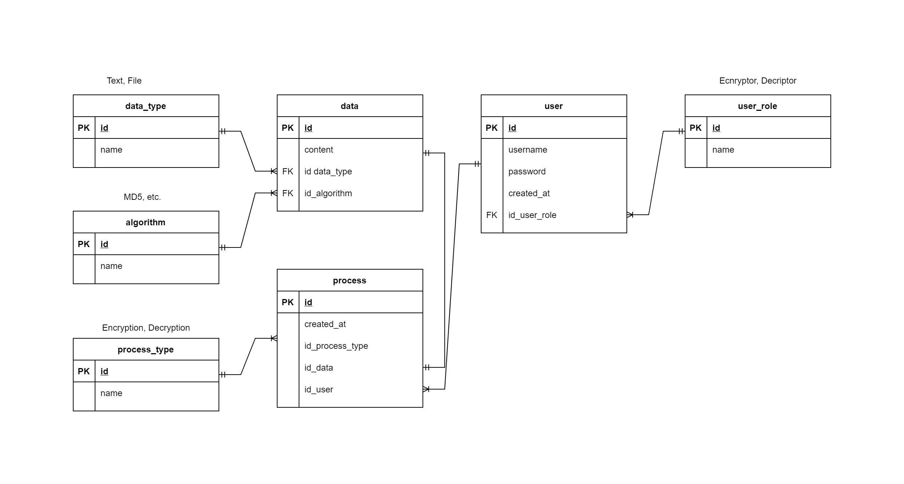

# Encryptor api
Encryptor api is the backend of [Encryptor App](https://github.com/chars-mc/encryptor-app).

The project was built following [REST](https://en.wikipedia.org/wiki/Representational_state_transfer) and the principles of [clean architecture](https://blog.cleancoder.com/uncle-bob/2012/08/13/the-clean-architecture.html) .

## Technologies

## Database

## Requirements

[Go](https://golang.org/)

[Docker](https://www.docker.com/)

[Mysql Docker Image](https://hub.docker.com/_/mysql)

[CompileDaemon](https://github.com/githubnemo/CompileDaemon):
`go get github.com/githubnemo/CompileDaemon`

[Migrate](https://github.com/golang-migrate/migrate):
`go install -tags 'mysql' github.com/golang-migrate/migrate/v4/cmd/migrate@v4.15.0`

## Usage

### Environment variables
Create a `.env` file on the root project based on `.env.example`.

### Migrations

Create a new migration: `migrate -ext sql -dir ./migrations -seq <name>`.

Migrate up: `make migrateup`.

Migrate down: `make migratedown`.
